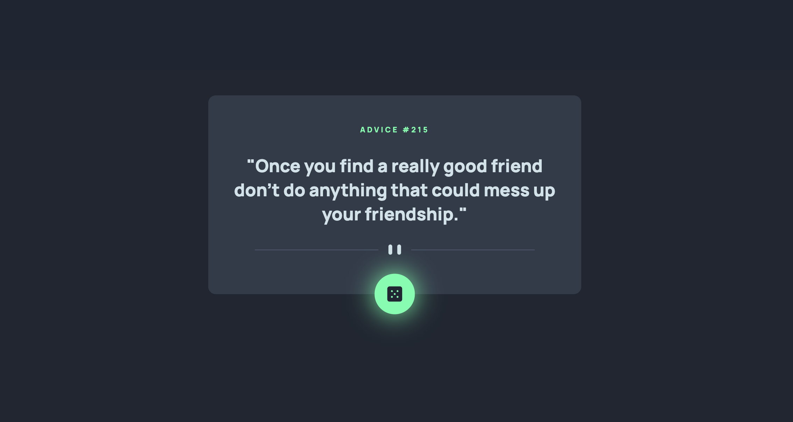
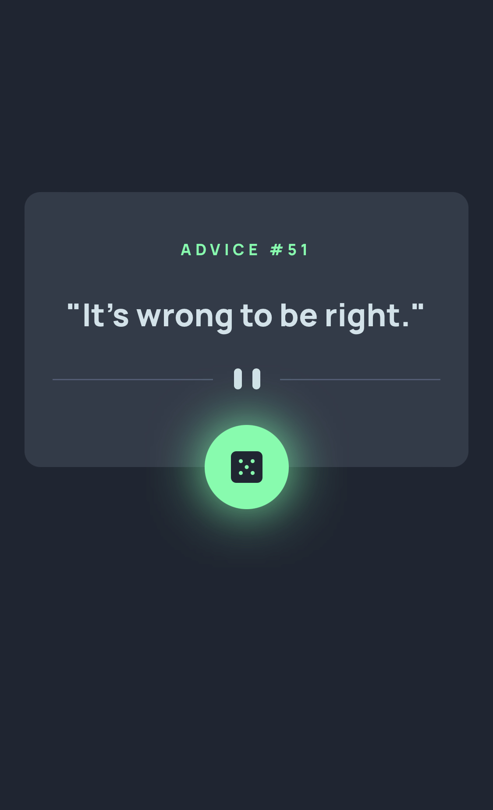

# Frontend Mentor - Advice generator app solution

This is a solution to the [Advice generator app challenge on Frontend Mentor](https://www.frontendmentor.io/challenges/advice-generator-app-QdUG-13db). Frontend Mentor challenges help you improve your coding skills by building realistic projects.

## Table of contents

- [Overview](#overview)
  - [The challenge](#the-challenge)
  - [Screenshot](#screenshot)
  - [Links](#links)
- [My process](#my-process)
  - [Built with](#built-with)
  - [What I learned](#what-i-learned)
  - [Useful resources](#useful-resources)
- [Author](#author)
- [Acknowledgments](#acknowledgments)

## Overview

### The challenge

Users should be able to:

- View the optimal layout for the app depending on their device's screen size
- See hover states for all interactive elements on the page
- Generate a new piece of advice by clicking the dice icon

### Screenshot




### Links

- Solution URL: [https://github.com/YusufAkilevi/Advice-Generator-App-Frontend-Mentor](https://github.com/YusufAkilevi/Advice-Generator-App-Frontend-Mentor)
- Live Site URL: [https://advice-generator-app-yakilevs.netlify.app/](https://advice-generator-app-yakilevs.netlify.app/)

## My process

### Built with

- Semantic HTML5 markup
- CSS custom properties
- Flexbox
- CSS Grid
- Desktop-first workflow
- JavaScript

### What I learned

I was able to use asynchronous JavaScript features such as async, await concepts and fetch function to get the data. And I also basically handled the errors.

Also, I learned to give a glowing hover effect by using box-shadow property:

```css
.icon-dice-button:hover {
  box-shadow: 0 0 40px rgba(82, 255, 169);
}
```

### Useful resources

- [MDN](https://developer.mozilla.org/en-US/) - This helped me to find anything related Javascript, CSS or HTMl.
- [CSS Tricks](https://css-tricks.com/) - This website explains css properties really easy to understand and provide example codes.

## Author

- Frontend Mentor - [@YusufAkilevi](https://www.frontendmentor.io/profile/YusufAkilevi)
- Twitter - [@yusufakilevii](https://twitter.com/yusufakilevii)
- GitHub - [@YusufAkilevi](https://github.com/YusufAkilevi)

## Acknowledgments

I worked alone in this project and I hope I would have an opportunity to work on an open source project with other developers.
